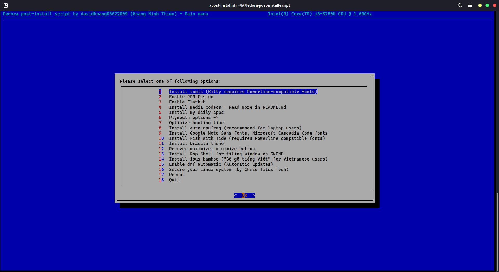
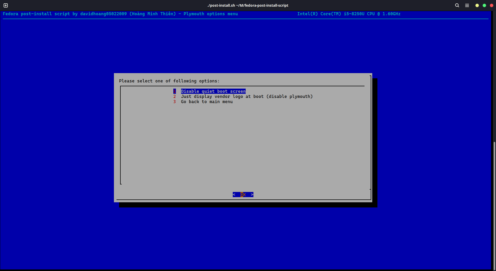

<!-- ./README.md -->
<!-- SPDX-License-Identifier: GPL-3.0-or-later -->

<!--
fedora-post-install-script
Copyright (C) 2021 davidhoang05022009(Hoàng Minh Thiên)
This program comes with ABSOLUTELY NO WARRANTY
This is free software, and you are welcome to redistribute it
under certain conditions

Licensed under GPLv3 License
-->

# fedora-post-install-script

#### Note: This script is only compatible on Fedora GNOME flavor(The default Fedora Workstation flavor)

## Screenshots





## How to run?

1. Make sure `git` is usable<br>
   If not, install it:

```sh
sudo dnf install git -y
```

2. Open Terminal, type:

```sh
git clone https://github.com/davidhoang05022009/fedora-post-install-script
cd ./fedora-post-install-script
```

3. Run it:

```sh
chmod +x ./post-install.sh
./post-install.sh
```

## What can this script do?

1. Speed-up and optimize `dnf`
2. Check update for your system
3. Install some tools, includes: `htop`, `neofetch`, `xclip`, `axel`, `gnome-tweaks`, `deltarpm`, `micro`, `code`(VSCode), `dnf-automatic`, `unzip`, `gh` ([GitHub CLI](https://cli.github.com/)), `github-desktop`
4. Enable RPM Fusion, Flathub
5. Install media codecs(from the docs [here](https://docs.fedoraproject.org/en-US/quick-docs/assembly_installing-plugins-for-playing-movies-and-music/))
6. Disable "quiet" boot screen and optimize boot time (make your boot screen look like hacker's screen XD) (make some changes to GRUB config file, don't worry, I tested it and it's fine)
<br>(My laptop is using SSD, it takes only 5 seconds to boot up after optimize)
7. Install auto-cpufreq for laptop users
8. Install Google Noto Sans fonts, Microsoft Cascadia Code fonts, Starship and Dracula theme
9. Recover the maximize and minimize button (disabled by default)
10. Install Pop Shell for tiling window on GNOME
11. Secure your Linux system by setting up ufw, fail2ban (This one is from Chris Titus Tech)
12. Install ibus-bamboo

## Found an issue?

Create an issue with `Bug report` template

## Special thanks to:

- Google for the [Noto Sans fonts](https://fonts.google.com/noto/specimen/Noto+Sans?query=Noto+Sans) (with OFL License)
- Microsoft and their contributors for the [Cascadia Code fonts](https://github.com/microsoft/cascadia-code) (with OFL License) and [VSCode](https://github.com/Microsoft/vscode) (with MIT License)
- The Dracula team and their contributors for the [Dracula Theme for GTK](https://github.com/dracula/gtk) (with GPLv3 License)
- The [TechHut YouTube channel](https://www.youtube.com/c/TechHutHD) for the video ["5 Things You MUST DO After Installing Fedora 35"](https://www.youtube.com/watch?v=-NwWE9YFFIg)
- [Starship](https://starship.rs/) and their contributors for the beautiful shell prompt for bash(I personally don't like zsh or fish, bash is enough for me)
- The official Fedora docs for the guide [how to setup automatic updates](https://docs.fedoraproject.org/en-US/quick-docs/autoupdates/) and [codecs install](https://docs.fedoraproject.org/en-US/quick-docs/assembly_installing-plugins-for-playing-movies-and-music/)
- The [StackOverflow](https://stackoverflow.com), [AskUbuntu](https://askubuntu.com) community for helping me writing themes, fonts install script
- [ibus-bamboo](https://github.com/BambooEngine/ibus-bamboo) for the Vietnamese input service on Linux(thanks to [OpenBuildService](https://software.opensuse.org//download.html?project=home%3Alamlng&package=ibus-bamboo) for the Fedora ibus-bamboo build)
- [Zachary Yedidia (zyedidia)](https://github.com/zyedidia) and contributors for the [Micro Text Editor](https://github.com/zyedidia/micro)
- [system76](https://system76.com) and contributors for the [Pop Shell](https://github.com/pop-os/shell)
- [Adnan Hodzic](https://github.com/AdnanHodzic) and contributors for the [auto-cpufreq](https://github.com/AdnanHodzic/auto-cpufreq/) utility
- [Osiris](https://github.com/osiris2600) for the [fedora-setup](https://github.com/osiris2600/fedora-setup) that my script based on
- [Chris Titus Tech](https://github.com/ChrisTitusTech) for the [secure-linux script](https://github.com/ChrisTitusTech/secure-linux), go check out [his YouTube channel](https://www.youtube.com/c/ChrisTitusTech) and [his website](https://www.christitus.com/), he has many good videos about Linux
- [Willi Mutschler](https://mutschler.eu/) for [BTRFS optimization for SSD](https://mutschler.eu/linux/install-guides/fedora-post-install/#btrfs-filesystem-optimizations) and some more things in [this guide](https://mutschler.eu/linux/install-guides/fedora-post-install/)
- [ArchWiki](https://wiki.archlinux.org) for the [silent boot guide](https://wiki.archlinux.org/title/Silent_boot) and [Improving performance/Boot process guide](https://wiki.archlinux.org/title/Improving_performance/Boot_process) (yes this is Fedora but ArchWiki is also useful too XD)

## License

This repository is licensed under GPLv3 License, see it [here](./LICENSE)</br>
Copyright (C) 2021 davidhoang05022009(Hoàng Minh Thiên)</br>
This program comes with ABSOLUTELY NO WARRANTY</br>
This is free software, and you are welcome to redistribute it
under certain conditions

Please note that I am using a GPG signature to verify commits now (for security reasons in the future)
